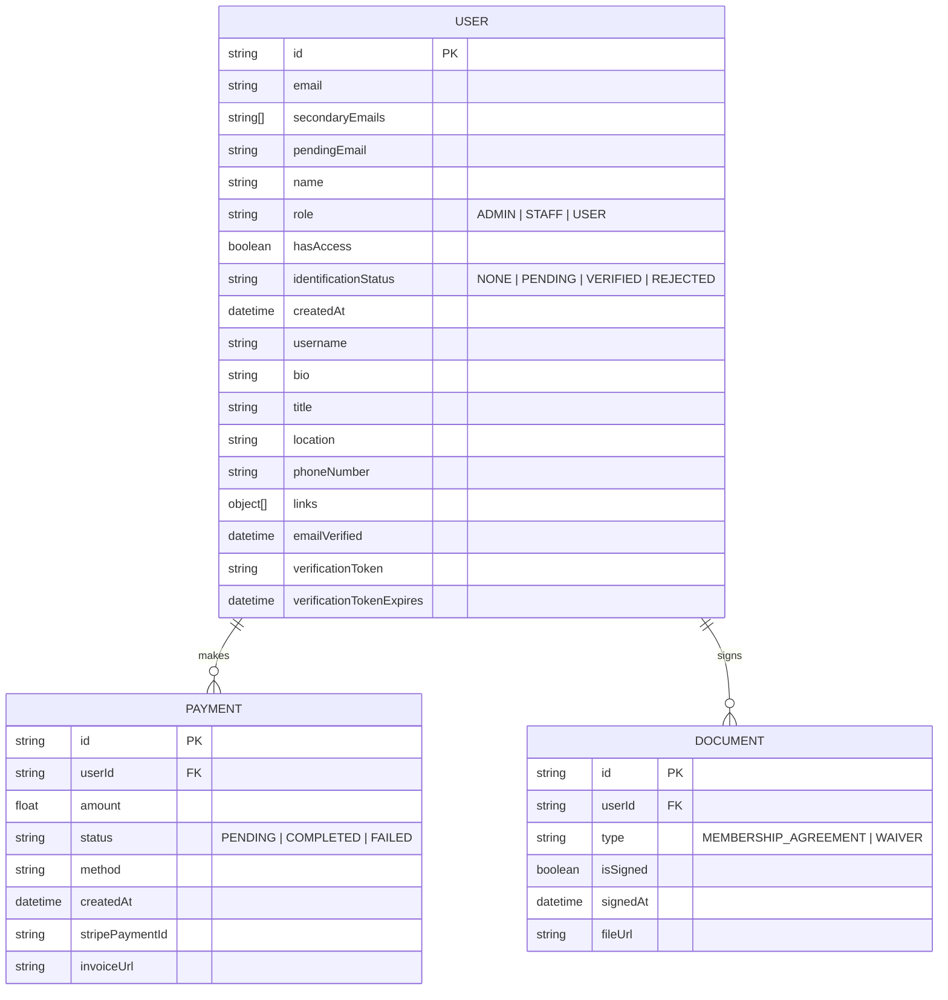
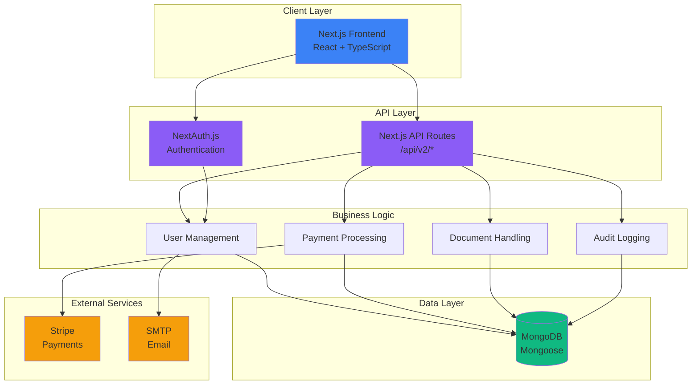
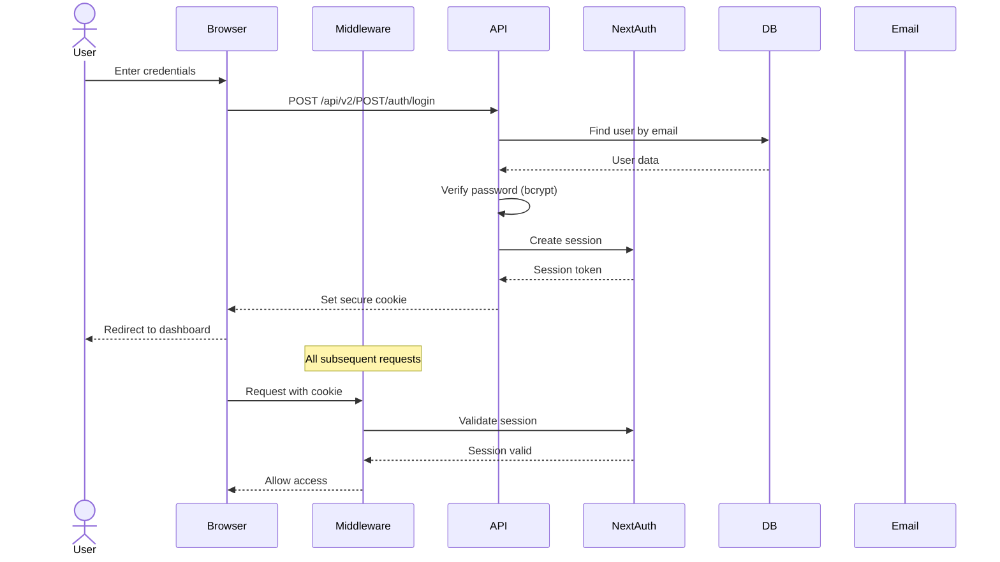
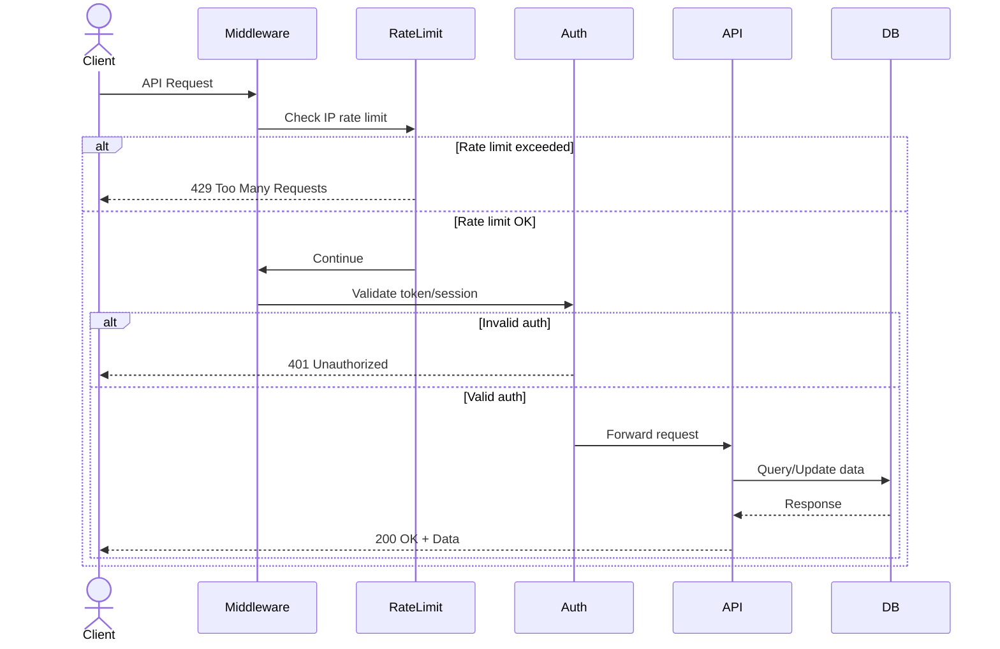
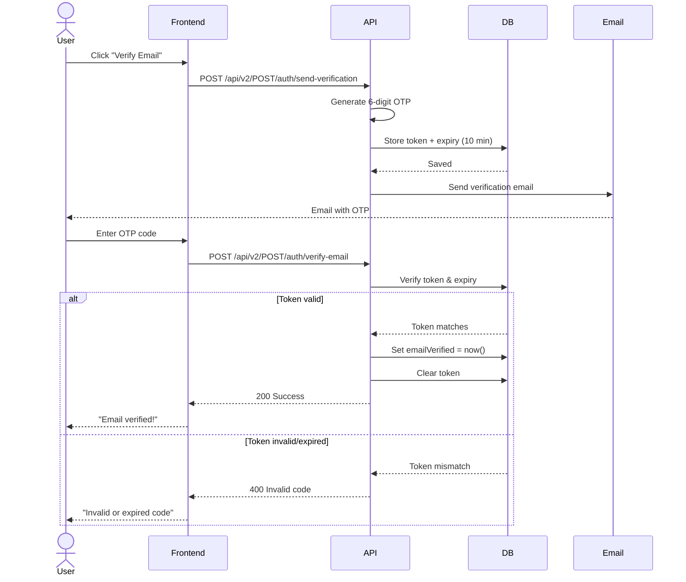
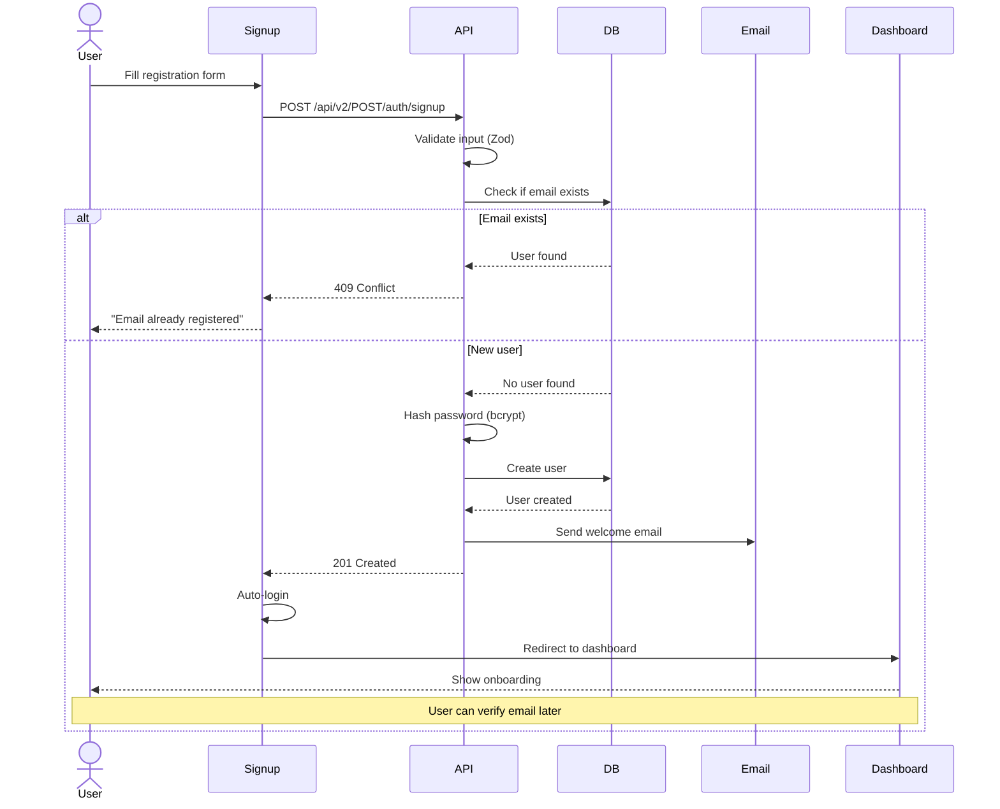
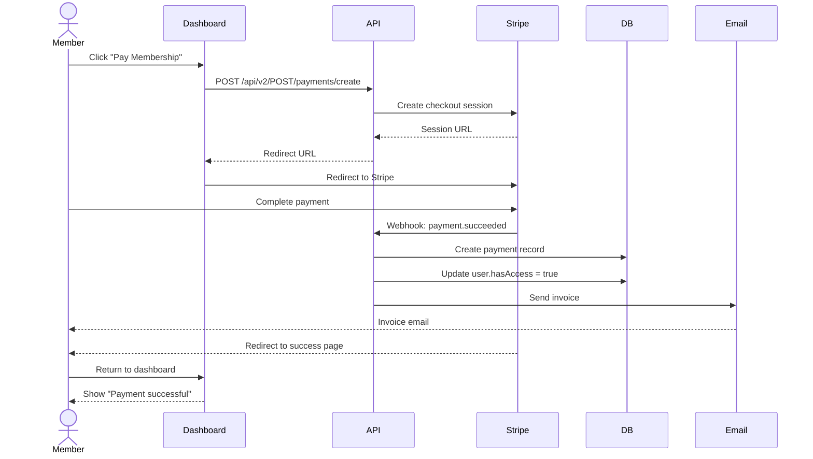
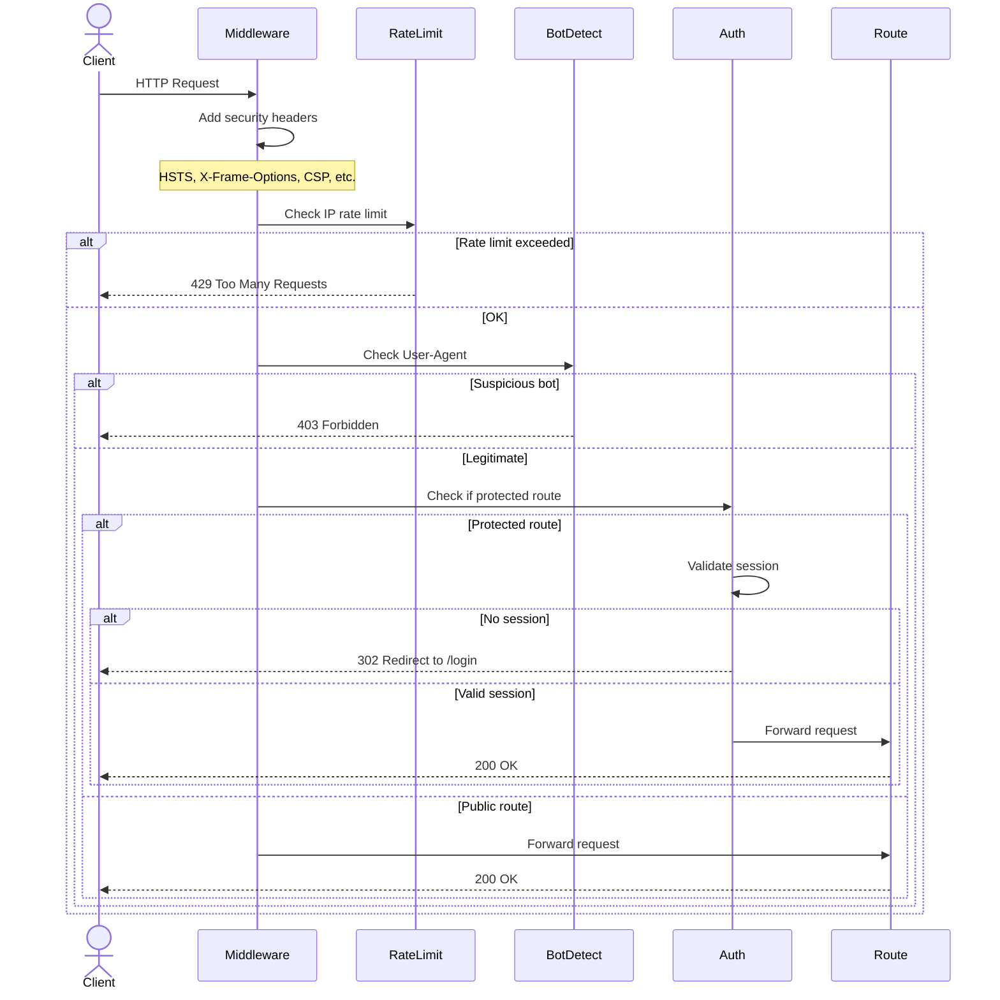

# Prishtina Hackerspace CRM

> Member management system for [Prishtina Hackerspace](https://prishtinahackerspace.org), operated by [FLOSSK](https://flossk.org) (Free Libre Open Source Software Kosova).

A modern, secure CRM platform built with Next.js 16, TypeScript, and MongoDB for managing hackerspace memberships, billing, and community engagement.

---

## 📖 About This Project

### What is Prishtina Hackerspace?

Prishtina Hackerspace is a **community-driven makerspace** in Kosovo where hackers, makers, artists, and technologists come together to learn, collaborate, and create. It's part of **FLOSSK's** (Free Libre Open Source Software Kosova) mission to promote free and open-source software and foster a vibrant tech community.

### What Does This CRM Do?

This platform serves as the central operational heartbeat of Prishtina Hackerspace. It is designed to manage the entire lifecycle of a community member, beginning with a secure registration and identity verification process. Once onboarded, the system handles complex billing cycles and automated payment tracking through a deep integration with Stripe, ensuring that memberships remain active and financial records are transparent. Beyond administrative tasks, the CRM facilitates community engagement by hosting a member directory and leaderboards, while simultaneously acting as the primary gatekeeper for the physical space through a low-latency IOT check-in system. Every sensitive action is governed by a forensic audit engine that provides a clear and immutable trail of system activity, including real-time heuristic analysis for threat detection and anomaly scoring. All organizational policies and legal compliance measures are integrated directly into the workflow to ensure a safe and transparent environment for all hackers.


- 💳 **Billing & Payments** - Membership fees, invoices, and payment tracking (Stripe integration)
- 📧 **Communication** - Email verification, notifications, and announcements
- 🔐 **Access Control** - Authentication, role-based permissions, and forensic audit logging
- �️ **Security Intelligence** - Heuristic ML for threat detection and anomaly scores
- �📄 **Document Management** - Membership agreements, waivers, and secured identity archives
- 📊 **Analytics** - 7-day activity trends, security health baselines, and event distributions
- ⚖️ **Legal Compliance** - Privacy policy, terms of service, and community code of conduct

### Key Goals for the Platform

Our primary objective is to dramatically simplify the complex operations involved in running a community-driven makerspace. By automating membership management and billing, we aim to reduce administrative overhead, allowing more time to be spent on creative collaboration rather than paperwork. Security is the foundation of this project; we prioritize the protection of member data through state-of-the-art authentication and multi-layered encryption. Furthermore, we strive to build a more connected community by providing features that encourage social interaction and recognition through transparent leaderboards and detailed profiles. The platform is engineered for transparency, ensuring that all legal policies, billing events, and forensic audit trails are easily accessible to members. Ultimately, this system is built to scale, providing a robust and extensible blueprint that can support the growth of the Prishtina community and future hackerspace locations.

---

## 🛡️ Security Hardening (V2 Upgrade)

The V2 release represents a comprehensive security overhaul of the PRHS platform, addressing critical vulnerabilities discovered during security audits and implementing advanced threat detection capabilities.

### 🚨 Critical Vulnerabilities Fixed

**1. Forensic Cold-Spots (CVE-PRHS-2024-001)**
- **Problem**: Administrative actions (role changes, access grants, payment verifications) were logged as simple event notifications without capturing state changes. This made forensic investigations impossible—we couldn't reconstruct WHO changed WHAT to WHAT VALUE.
- **Impact**: Zero accountability for privilege escalation, impossible to detect insider threats or compromised admin accounts.
- **Solution**: Implemented comprehensive JSON Diff engine that captures "before vs. after" snapshots for every mutation. All administrative updates now record `changes: { from: oldState, to: newState }` in audit logs.
- **Verification**: Every PATCH/PUT endpoint now logs complete state transitions with millisecond timestamps and actor attribution.

**2. Static Detection Thresholds (CVE-PRHS-2024-002)**
- **Problem**: Brute-force and abuse detection used hardcoded thresholds (e.g., "5 failures = threat"). Sophisticated attackers could stay below these limits indefinitely.
- **Impact**: Vulnerable to low-and-slow attacks, credential stuffing campaigns, and distributed brute-force attempts.
- **Solution**: Replaced static rules with a serverless Heuristic ML system that learns behavioral baselines. Uses Z-score anomaly detection (Mean + 3σ) to identify statistical deviations from normal activity patterns.
- **Verification**: System now automatically flags anomalies even when individual IPs stay below fixed thresholds, detecting coordinated attacks across multiple sources.

**3. Session Persistence Vulnerabilities (CVE-PRHS-2024-003)**
- **Problem**: Users had no mechanism to invalidate all sessions if their account was compromised. Individual logout only terminated the current device.
- **Impact**: Stolen session tokens remained valid indefinitely, allowing persistent unauthorized access even after password changes.
- **Solution**: Implemented `POST /api/v2/auth/logout-all` endpoint that invalidates every active refresh token across all devices simultaneously.
- **Verification**: Session revocation is atomic and immediate, with forensic audit trail of who triggered the security reset.

**4. IOT Surface Exposure (CVE-PRHS-2024-004)**
- **Problem**: RFID check-in terminals authenticated using only UID matching. Any device with a valid UID could impersonate a legitimate terminal.
- **Impact**: Rogue terminals could be deployed to harvest member RFID data or inject false presence records.
- **Solution**: Implemented JWT-signed hardware tokens with cryptographic verification. Terminals must present valid signatures to interact with the presence API.
- **Verification**: All check-in requests now require both valid UID AND cryptographically signed terminal JWT, with hardware fingerprinting.

### 🧠 Major Security Enhancements

**1. Heuristic Behavioral Analytics**
- Serverless Machine Learning engine that continuously learns "normal" hackerspace activity patterns
- Rolling statistical baselines (mean, standard deviation) calculated across hourly windows
- Automatic anomaly flagging using Z-score calculations (threshold: 3σ)
- Sampled learning (1% of events) to adapt to evolving usage patterns without performance impact
- Dedicated `SecurityBaseline` model tracking global system health metrics

**2. 7-Day Security Horizon Dashboard**
- Advanced longitudinal analytics visualizing failure and threat trends over rolling weekly windows
- Real-time category volume distribution (Authentication, Identity, Payments, Admin Actions)
- Top failing IPs with geographic correlation and threat severity scoring
- Heuristic baseline health monitoring showing current Mean, StdDev, and sample size
- Interactive threat resolution workflow with status tracking (ACTIVE → RESOLVED → BANNED)

**3. Comprehensive Forensic Audit Trails**
- 100% coverage of all mutation endpoints (POST, PUT, PATCH, DELETE)
- Structured event taxonomy: `auth.*`, `user.*`, `admin.*`, `space.*`, `payment.*`
- Rich contextual metadata: IP address, User-Agent, request fingerprints, geolocation
- Severity classification (INFO, WARNING, CRITICAL) with automatic escalation rules
- Server-side pagination supporting 10,000+ log entries with sub-second query performance

**4. Automated Security Maintenance**
- Vercel Cron integration for periodic baseline recalculation (`/api/v2/cron/security/baseline`)
- Automatic model retraining adapts to community growth and seasonal usage patterns
- Secured with `CRON_SECRET` environment variable to prevent unauthorized triggering
- Execution logs captured in audit trail for compliance and debugging

**5. Enhanced Identity Verification**
- Double-envelope encryption for identity documents (Vault Key + User UUID)
- Dedicated `IdentityArchive` model with tamper-evident audit trails
- Administrative review workflow with mandatory reason codes for rejections
- Forensic logging of document uploads, reviews, and status transitions
- Integration with membership access gates (verified identity required for physical access)

---

## 🗄️ Database Schema

The system uses MongoDB with Mongoose for data modeling. Here's the core schema design:



### Mongoose Schema Depth

The PRHS data model is built on a resilient Foundation of Mongoose schemas. The **User** model is the most complex, handling not only primary and secondary email identities for flexible login, but also multi-role access control (ADMIN, STAFF, USER) and rich profile metadata. It integrates a dedicated email verification workflow and sensitive identification status tracking (NONE to VERIFIED) for high-security access. Financial transactions are secured within the **Payment** model, which maintains a direct relationship with Stripe identifiers and tracks the full lifecycle of a transaction from PENDING to COMPLETED or FAILED, including automated invoice links. Finally, our **Document** model governs the legal relationship with the member, tracking the signature status and secure storage paths for mandatory membership agreements and liability waivers.

---

## 🏗️ System Architecture



---

## 🔄 How It Works - Flow Diagrams

### Authentication Flow



### API Request Flow (with Rate Limiting)



### Email Verification Flow



### User Registration Journey



### Payment Processing Flow (Planned)



### Middleware Security Flow



---

## 🚀 Features

### Platform Feature Set

The PRHS platform is organized into several sophisticated functional layers designed to provide a seamless and secure experience for both members and administrators. At its core, the **Authentication and Security** layer utilizes NextAuth.js v5 for robust credential management, augmented by JWT-based API authentication for hardware and external service integration. Security is prioritized through mandatory email verification via time-limited OTP tokens, multi-layered rate limiting, and a forensic audit engine that captures state-change diffs for every sensitive operation. This is further enhanced by our heuristic intelligence system, which uses behavioral baselines and Z-score anomaly detection to identify and mitigate threats in real-time.

For **Community Management**, the system provides a detailed member directory and profile system where users can manage their bios, social links, and diverse contact methods. The membership life cycle is supported by a comprehensive dashboard that provides longitudinal activity trends and a leaderboard to foster engagement. From a **Legal and Administrative** perspective, the platform integrates automated privacy and policy enforcement, ensuring all participants adhere to our community guidelines while providing a transparent record of all legal agreements. We are currently actively developing deeper Role-Based Access Controls (RBAC), fully automated Stripe-based payment processing, and an encrypted document signing engine to further streamline hackerspace operations.


---

## ️ Tech Stack

### Technology Foundation

The Prishtina Hackerspace CRM is built upon a modern and resilient technology stack that prioritizes performance and developer velocity. We utilize **Next.js 16** and the App Router as our core framework, leveraging its advanced server components and routing capabilities for a highly responsive user experience. The entire codebase is written in **TypeScript**, ensuring strict type safety and reducing runtime errors across our complex security and business logic. Data persistence is managed through **MongoDB** and the Mongoose ODM, providing the flexibility needed for evolving community data structures.

For styling, we have adopted **Tailwind CSS v4.0**, utilizing its modernized utility-first approach to create a stunning, responsive design that supports first-class dark mode integration. Our UI component library is built on top of **shadcn/ui** and Radix UI primitives, ensuring maximum accessibility and a premium aesthetic throughout the application. All inbound data is strictly validated using the **Zod** schema library, while internal communications and verification flows are handled through a dedicated Nodemailer-based email engine. Visual consistency is maintained through the extensive use of Lucide and React Icons, providing a cohesive and modern interface for all platform users.

---

## 📦 Installation

### System Prerequisites

To successfully deploy and run the PRHS CRM, you must have a local or cloud-based instance of Node.js 20+ and the npm package manager. The application requires a persistent connection to a MongoDB database (local or cloud) and access to a configured SMTP server (such as Gmail or SendGrid) for all email-based authentication and notification workflows.

### Setup

1. **Clone the repository**
   ```bash
   git clone https://github.com/flossk/prhs-crm.git
   cd prhs-crm
   ```

2. **Install dependencies**
   ```bash
   npm install
   ```

3. **Configure environment variables**
   
   Create a `.env` file in the root directory:
   ```env
   # Database
   MONGODB_URI=mongodb://localhost:27017/prhs-crm
   
   # NextAuth
   NEXTAUTH_SECRET=your-secret-key-here
   NEXTAUTH_URL=http://localhost:3000
   
   # Email (SMTP)
   EMAIL_HOST=smtp.gmail.com
   EMAIL_PORT=587
   EMAIL_USER=your-email@gmail.com
   EMAIL_PASSWORD=your-app-password
   EMAIL_FROM=noreply@flossk.org
   
   # JWT (for API authentication)
   JWT_SECRET=your-jwt-secret-here
   ```

4. **Run the development server**
   ```bash
   npm run dev
   ```

5. **Open the app**
   
   Navigate to [http://localhost:3000](http://localhost:3000)

---

## 🏗️ Project Structure

```
prhs/
├── app/                      # Next.js App Router
│   ├── api/                  # API routes
│   │   └── v1/               # API v1
│   │       ├── auth/         # Authentication endpoints
│   │       └── users/        # User management endpoints
│   ├── auth/                 # Auth pages (login, signup, verify)
│   ├── dashboard/            # Protected dashboard pages
│   ├── privacy/              # Privacy Policy page
│   ├── terms/                # Terms of Service page
│   ├── policy/               # PRHS Policy page
│   └── layout.tsx            # Root layout
├── components/               # React components
│   ├── ui/                   # shadcn/ui components
│   └── dashboard/            # Dashboard-specific components
├── lib/                      # Utilities and helpers
│   ├── auth.ts               # NextAuth configuration
│   ├── api-auth.ts           # API authentication utility
│   ├── mongodb/              # MongoDB connection
│   └── prohibited-terms.json # Content moderation rules
├── models/                   # Mongoose schemas
│   ├── User.ts
│   ├── Payment.ts
│   ├── Document.ts
│   └── AuditLog.ts
├── types/                    # TypeScript type definitions
└── middleware.ts             # Next.js middleware (auth protection)
```

---

## 🔐 API Documentation (V2)

The system is powered by a robust V2 API suite with built-in forensic auditing and rate limiting.

### 🛡️ Security Intelligence Features
- **Heuristic ML**: Automated anomaly detection comparing real-time events against statistical baselines.
- **Forensic Trails**: Every sensitive mutation records a "Before vs After" snapshot of non-secret data.
- **CRON Automation**: Periodic recalculation of security baselines via `/api/v2/POST/cron/security/baseline`.

### Core Endpoints

#### `POST /api/v2/POST/auth/signup`
Register a new user.

**Request:**
```json
{
  "name": "John Doe",
  "email": "john@example.com",
  "password": "SecurePassword123!"
}
```

**Response:** `201 Created`
```json
{
  "message": "User created successfully",
  "userId": "507f1f77bcf86cd799439011"
}
```

#### `POST /api/v2/POST/auth/login`
Login with credentials.

**Request:**
```json
{
  "email": "john@example.com",
  "password": "SecurePassword123!"
}
```

**Response:** `200 OK` + session cookie

#### `POST /api/v2/POST/auth/send-verification`
Send email verification code.

**Auth:** Required (session)

**Response:** `200 OK`
```json
{
  "message": "Verification code sent"
}
```

#### `POST /api/v2/POST/auth/verify-email`
Verify email with OTP.

**Request:**
```json
{
  "token": "123456"
}
```

**Response:** `200 OK`

### User Management

#### `GET /api/v2/GET/users/:id`
Get user profile.

**Auth:** Required (self or admin)

**Response:** `200 OK`
```json
{
  "user": {
    "id": "507f1f77bcf86cd799439011",
    "name": "John Doe",
    "email": "john@example.com",
    "emailVerified": "2025-12-26T12:00:00Z",
    "bio": "Maker and hacker",
    "title": "Software Engineer",
    "location": "Prishtina, Kosovo",
    "links": [
      { "id": "1", "platform": "github", "url": "https://github.com/johndoe" }
    ],
    "secondaryEmails": ["john.doe@example.com"]
  }
}
```

#### `PATCH /api/v2/PATCH/users/:id`
Update user profile.

**Auth:** Required (self or admin)

**Request:**
```json
{
  "name": "John Doe",
  "bio": "Updated bio",
  "title": "Senior Engineer",
  "location": "Prishtina, Kosovo",
  "links": [...]
}
```

**Response:** `200 OK`

#### `POST /api/v2/POST/auth/emails`
Add secondary email.

**Auth:** Required

**Request:**
```json
{
  "email": "john.alt@example.com"
}
```

**Response:** `200 OK`

#### `DELETE /api/v2/DELETE/auth/emails`
Remove secondary email.

**Auth:** Required

**Request:**
```json
{
  "email": "john.alt@example.com"
}
```

**Response:** `200 OK`

---

## 🧪 Testing

```bash
# Run linter
npm run lint

# Run tests (coming soon)
npm test
```

---

## 🚀 Deployment

### Production Build

```bash
npm run build
npm start
```

### Environment Variables for Production

When deploying the PRHS platform to a production environment, it is critical to ensure that all security and operational variables are correctly configured. This includes a production-grade MongoDB connection string (`MONGODB_URI`) and a cryptographically strong `NEXTAUTH_SECRET` for secure session signing. The `NEXTAUTH_URL` must be set to the official production domain (e.g., `https://crm.prishtinahackerspace.org`) to ensure correct callback and redirect behavior. Additionally, a full suite of SMTP configuration variables (Host, Port, User, Password, and From address) must be provided to maintain our verification and notification flows. Security for our hardware and external service integration is governed by the `JWT_SECRET`, which must be a high-entropy string unique to the production environment.

---

## 📝 License

This project is licensed under the **MIT License** - see the [LICENSE](LICENSE) file for details.

---

## 🤝 Contributing

We welcome contributions! Please follow these steps:

1. Fork the repository
2. Create a feature branch (`git checkout -b feature/amazing-feature`)
3. Commit your changes (`git commit -m 'Add amazing feature'`)
4. Push to the branch (`git push origin feature/amazing-feature`)
5. Open a Pull Request

### Code of Conduct

Please read our [PRHS Policy](/policy) for community guidelines.

---

## 📧 Contact

- **Organization:** Free Libre Open Source Software Kosova (FLOSSK)
- **Email:** info@flossk.org
- **Website:** [flossk.org](https://flossk.org)
- **Hackerspace:** [prishtinahackerspace.org](https://prishtinahackerspace.org)

---

## 🙏 Acknowledgments

- Built with ❤️ by the FLOSSK community
- UI components from [shadcn/ui](https://ui.shadcn.com/)
- Inspired by the maker and hacker community in Kosovo

---

**Made with 🔧 in Prishtina, Kosovo**
