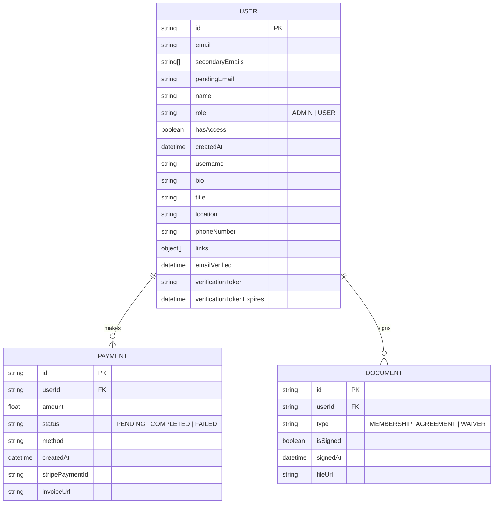
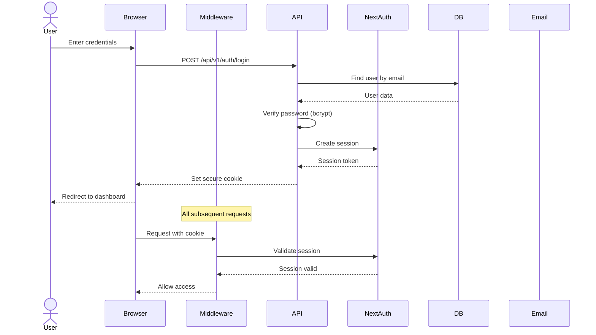
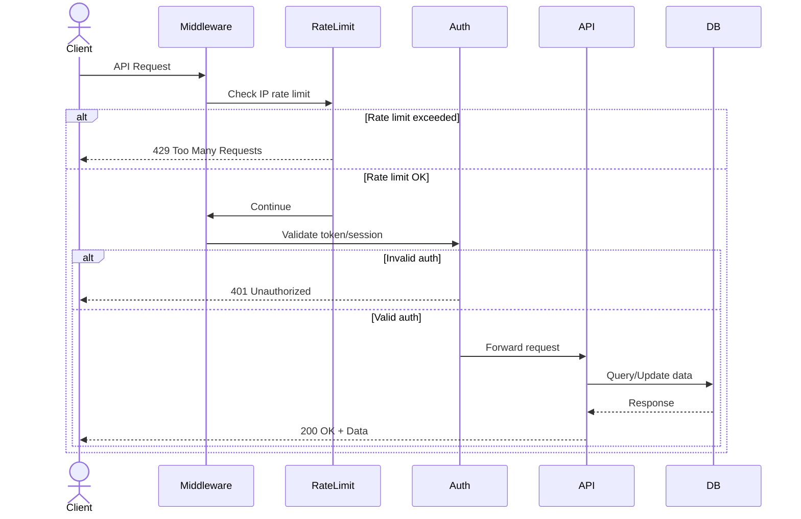
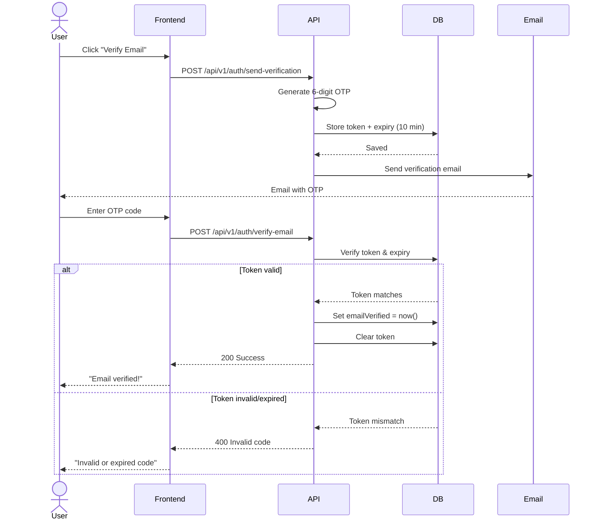
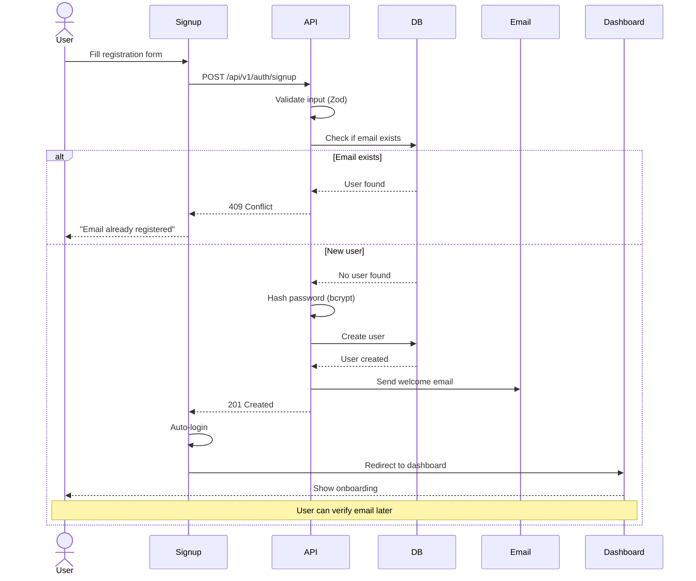
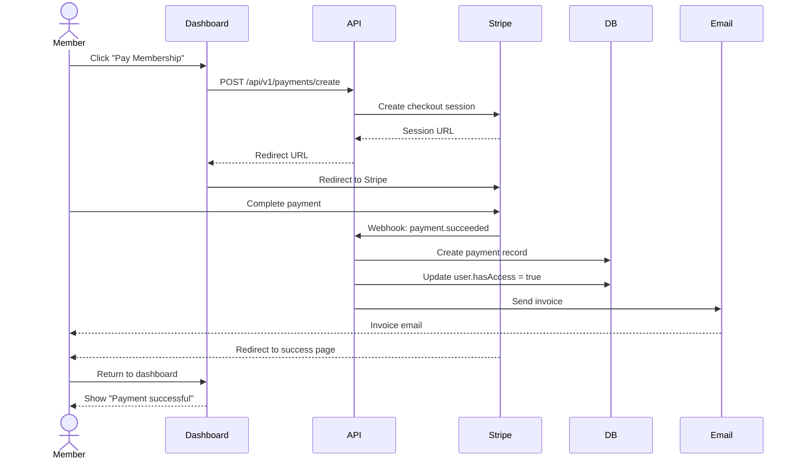
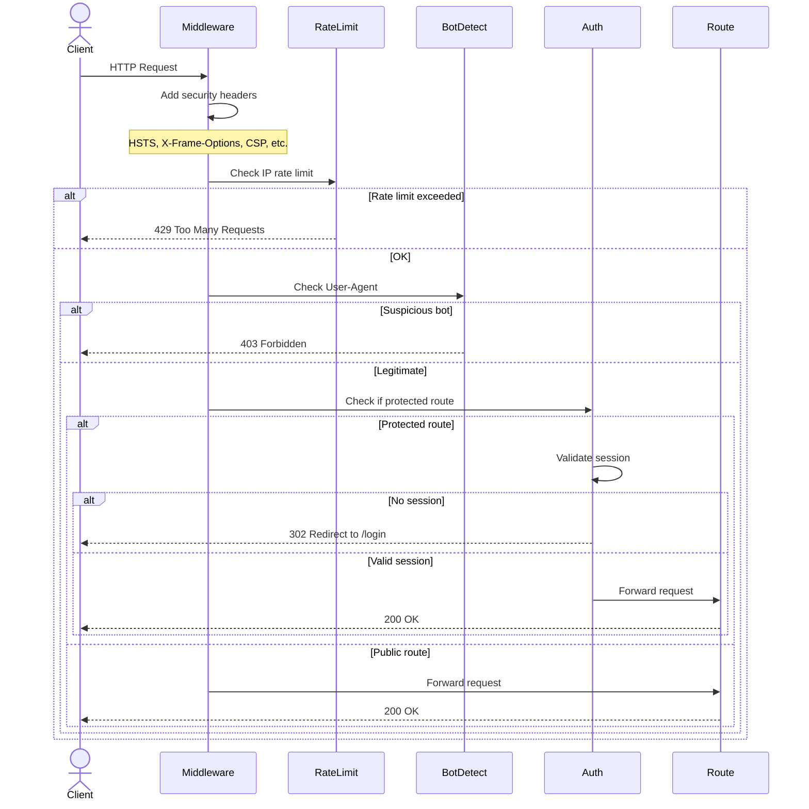

# Prishtina Hackerspace CRM

> Member management system for [Prishtina Hackerspace](https://prishtinahackerspace.org), operated by [FLOSSK](https://flossk.org) (Free Libre Open Source Software Kosova).

A modern, secure CRM platform built with Next.js 16, TypeScript, and MongoDB for managing hackerspace memberships, billing, and community engagement.

---

## 📖 About This Project

### What is Prishtina Hackerspace?

Prishtina Hackerspace is a **community-driven makerspace** in Kosovo where hackers, makers, artists, and technologists come together to learn, collaborate, and create. It's part of **FLOSSK's** (Free Libre Open Source Software Kosova) mission to promote free and open-source software and foster a vibrant tech community.

### What Does This CRM Do?

This platform serves as the **central management system** for the hackerspace, handling:

- 👥 **Member Management** - Registration, profiles, and member directory
- 💳 **Billing & Payments** - Membership fees, invoices, and payment tracking (Stripe integration)
- 📧 **Communication** - Email verification, notifications, and announcements
- 🔐 **Access Control** - Authentication, role-based permissions, and audit logging
- 📄 **Document Management** - Membership agreements, waivers, and signed documents
- 📊 **Analytics** - Member engagement, leaderboards, and activity tracking
- ⚖️ **Legal Compliance** - Privacy policy, terms of service, and community code of conduct

### Key Goals

1. **Simplify Operations** - Automate membership management and reduce administrative overhead
2. **Enhance Security** - Protect member data with modern authentication and encryption
3. **Build Community** - Foster engagement through profiles, leaderboards, and social features
4. **Ensure Transparency** - Provide clear billing, legal policies, and audit trails
5. **Enable Growth** - Scale to support more members and future hackerspace locations

---

## 🗄️ Database Schema

The system uses MongoDB with Mongoose for data modeling. Here's the core schema design:



### Schema Details

**USER** - Core member data
- Primary email + secondary emails for flexible login
- Role-based access control (ADMIN, USER)
- Rich profile fields (bio, job title, social links)
- Email verification workflow with OTP tokens

**PAYMENT** - Billing and transaction records
- Stripe integration for payment processing
- Invoice generation and tracking
- Payment status monitoring

**DOCUMENT** - Legal documents and agreements
- Membership agreements and liability waivers
- Digital signature tracking
- Document storage and retrieval

---

## 🏗️ System Architecture


---

## 🔄 How It Works - Flow Diagrams

### Authentication Flow



### API Request Flow (with Rate Limiting)



### Email Verification Flow



### User Registration Journey



### Payment Processing Flow (Planned)



### Middleware Security Flow



---

## 🚀 Features

### ✅ Implemented
- **Authentication & Security**
  - NextAuth.js v5 with credentials provider
  - JWT-based API authentication
  - Email verification with OTP
  - Session management with secure cookies
  - Rate limiting on auth endpoints
  - Audit logging for security events
  
- **User Management**
  - User registration and login
  - Profile management (bio, job title, location, social links)
  - Email management (primary + secondary emails for login)
  - Email change flow with verification
  - Dark mode support
  
- **Dashboard**
  - Member overview with leaderboard
  - Settings page with consolidated tabs (General, Account, Billing, Preferences)
  - Responsive sidebar navigation
  
- **Legal Pages**
  - Privacy Policy (`/privacy`)
  - Terms of Service (`/terms`)
  - PRHS Policy - Code of Conduct (`/policy`)

### 🚧 In Progress
- Role-Based Access Control (RBAC)
- Payment processing (Stripe integration)
- Document signing and storage
- Unit and E2E testing

---

## 🛠️ Tech Stack

- **Framework:** [Next.js 16](https://nextjs.org/) (App Router)
- **Language:** [TypeScript](https://www.typescriptlang.org/)
- **Database:** [MongoDB](https://www.mongodb.com/) with [Mongoose](https://mongoosejs.com/)
- **Authentication:** [NextAuth.js v5](https://next-auth.js.org/)
- **UI Components:** [shadcn/ui](https://ui.shadcn.com/) + [Radix UI](https://www.radix-ui.com/)
- **Styling:** [Tailwind CSS v4](https://tailwindcss.com/)
- **Validation:** [Zod](https://zod.dev/)
- **Email:** [Nodemailer](https://nodemailer.com/)
- **Icons:** [Lucide React](https://lucide.dev/) + [React Icons](https://react-icons.github.io/react-icons/)

---

## 📦 Installation

### Prerequisites
- Node.js 20+ and npm
- MongoDB instance (local or cloud)
- SMTP server for email (e.g., Gmail, SendGrid)

### Setup

1. **Clone the repository**
   ```bash
   git clone https://github.com/flossk/prhs-crm.git
   cd prhs-crm
   ```

2. **Install dependencies**
   ```bash
   npm install
   ```

3. **Configure environment variables**
   
   Create a `.env` file in the root directory:
   ```env
   # Database
   MONGODB_URI=mongodb://localhost:27017/prhs-crm
   
   # NextAuth
   NEXTAUTH_SECRET=your-secret-key-here
   NEXTAUTH_URL=http://localhost:3000
   
   # Email (SMTP)
   EMAIL_HOST=smtp.gmail.com
   EMAIL_PORT=587
   EMAIL_USER=your-email@gmail.com
   EMAIL_PASSWORD=your-app-password
   EMAIL_FROM=noreply@flossk.org
   
   # JWT (for API authentication)
   JWT_SECRET=your-jwt-secret-here
   ```

4. **Run the development server**
   ```bash
   npm run dev
   ```

5. **Open the app**
   
   Navigate to [http://localhost:3000](http://localhost:3000)

---

## 🏗️ Project Structure

```
prhs/
├── app/                      # Next.js App Router
│   ├── api/                  # API routes
│   │   └── v1/               # API v1
│   │       ├── auth/         # Authentication endpoints
│   │       └── users/        # User management endpoints
│   ├── auth/                 # Auth pages (login, signup, verify)
│   ├── dashboard/            # Protected dashboard pages
│   ├── privacy/              # Privacy Policy page
│   ├── terms/                # Terms of Service page
│   ├── policy/               # PRHS Policy page
│   └── layout.tsx            # Root layout
├── components/               # React components
│   ├── ui/                   # shadcn/ui components
│   └── dashboard/            # Dashboard-specific components
├── lib/                      # Utilities and helpers
│   ├── auth.ts               # NextAuth configuration
│   ├── api-auth.ts           # API authentication utility
│   ├── mongodb/              # MongoDB connection
│   └── prohibited-terms.json # Content moderation rules
├── models/                   # Mongoose schemas
│   ├── User.ts
│   ├── Payment.ts
│   ├── Document.ts
│   └── AuditLog.ts
├── types/                    # TypeScript type definitions
└── middleware.ts             # Next.js middleware (auth protection)
```

---

## 🔐 API Documentation

### Authentication

#### `POST /api/v1/auth/signup`
Register a new user.

**Request:**
```json
{
  "name": "John Doe",
  "email": "john@example.com",
  "password": "SecurePassword123!"
}
```

**Response:** `201 Created`
```json
{
  "message": "User created successfully",
  "userId": "507f1f77bcf86cd799439011"
}
```

#### `POST /api/v1/auth/login`
Login with credentials.

**Request:**
```json
{
  "email": "john@example.com",
  "password": "SecurePassword123!"
}
```

**Response:** `200 OK` + session cookie

#### `POST /api/v1/auth/send-verification`
Send email verification code.

**Auth:** Required (session)

**Response:** `200 OK`
```json
{
  "message": "Verification code sent"
}
```

#### `POST /api/v1/auth/verify-email`
Verify email with OTP.

**Request:**
```json
{
  "token": "123456"
}
```

**Response:** `200 OK`

### User Management

#### `GET /api/v1/users/:id`
Get user profile.

**Auth:** Required (self or admin)

**Response:** `200 OK`
```json
{
  "user": {
    "id": "507f1f77bcf86cd799439011",
    "name": "John Doe",
    "email": "john@example.com",
    "emailVerified": "2025-12-26T12:00:00Z",
    "bio": "Maker and hacker",
    "title": "Software Engineer",
    "location": "Prishtina, Kosovo",
    "links": [
      { "id": "1", "platform": "github", "url": "https://github.com/johndoe" }
    ],
    "secondaryEmails": ["john.doe@example.com"]
  }
}
```

#### `PATCH /api/v1/users/:id`
Update user profile.

**Auth:** Required (self or admin)

**Request:**
```json
{
  "name": "John Doe",
  "bio": "Updated bio",
  "title": "Senior Engineer",
  "location": "Prishtina, Kosovo",
  "links": [...]
}
```

**Response:** `200 OK`

#### `POST /api/v1/users/emails`
Add secondary email.

**Auth:** Required

**Request:**
```json
{
  "email": "john.alt@example.com"
}
```

**Response:** `200 OK`

#### `DELETE /api/v1/users/emails`
Remove secondary email.

**Auth:** Required

**Request:**
```json
{
  "email": "john.alt@example.com"
}
```

**Response:** `200 OK`

---

## 🧪 Testing

```bash
# Run linter
npm run lint

# Run tests (coming soon)
npm test
```

---

## 🚀 Deployment

### Production Build

```bash
npm run build
npm start
```

### Environment Variables for Production

Ensure all environment variables are set in your production environment:
- `MONGODB_URI` - Production MongoDB connection string
- `NEXTAUTH_SECRET` - Strong secret for NextAuth
- `NEXTAUTH_URL` - Production URL (e.g., `https://crm.prishtinahackerspace.org`)
- Email configuration (SMTP)
- `JWT_SECRET` - Strong secret for JWT tokens

---

## 📝 License

This project is licensed under the **MIT License** - see the [LICENSE](LICENSE) file for details.

---

## 🤝 Contributing

We welcome contributions! Please follow these steps:

1. Fork the repository
2. Create a feature branch (`git checkout -b feature/amazing-feature`)
3. Commit your changes (`git commit -m 'Add amazing feature'`)
4. Push to the branch (`git push origin feature/amazing-feature`)
5. Open a Pull Request

### Code of Conduct

Please read our [PRHS Policy](/policy) for community guidelines.

---

## 📧 Contact

- **Organization:** Free Libre Open Source Software Kosova (FLOSSK)
- **Email:** info@flossk.org
- **Website:** [flossk.org](https://flossk.org)
- **Hackerspace:** [prishtinahackerspace.org](https://prishtinahackerspace.org)

---

## 🙏 Acknowledgments

- Built with ❤️ by the FLOSSK community
- UI components from [shadcn/ui](https://ui.shadcn.com/)
- Inspired by the maker and hacker community in Kosovo

---

**Made with 🔧 in Prishtina, Kosovo**
